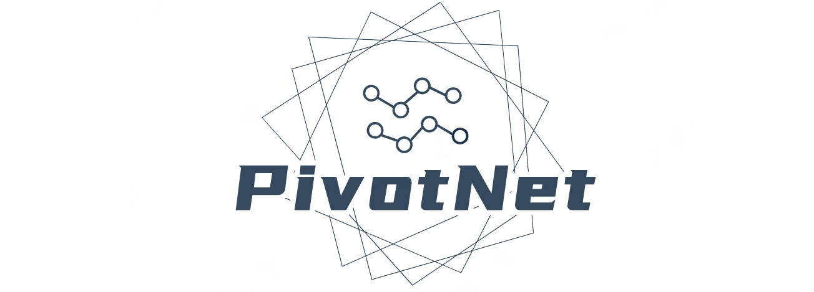
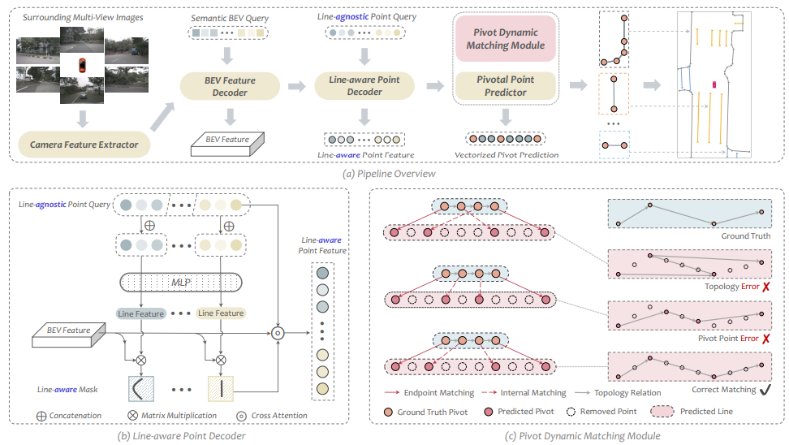

<div align="center"></div>
<div align="center"></div>

#
### NEWS !!!
* **`Jan. 15th, 2024`:** :rocket: :rocket: :rocket: The official implementation of our PivotNet is released now. Enjoy it!
* **`Jul. 14th, 2023`:** :clap: Our **PivotNet** is accepted by ICCV 2023 ! Refer to the **[Long-version Paper](https://arxiv.org/pdf/2308.16477)** for more details.zz
* **`May. 26th, 2023`:** :trophy: Our team win the **Championship** and the **Innovation-Award** of the CVPR23 *Online HD Map Construction Challenge* ! [ **[Leaderboard](https://opendrivelab.com/AD23Challenge.html#online_hd_map_construction)** / **[Tech-Report](https://arxiv.org/abs/2306.10301)**]
* **`Feb. 28th, 2023`:** :clap: Our **BeMapNet** is accepted by CVPR 2023 ! Refer to the **[Paper](https://openaccess.thecvf.com/content/CVPR2023/html/Qiao_End-to-End_Vectorized_HD-Map_Construction_With_Piecewise_Bezier_Curve_CVPR_2023_paper.html)** for more details. [**[Long version on Arxiv](https://arxiv.org/pdf/2306.09700)** / **[Code](https://github.com/er-muyue/BeMapNet/tree/main)**]

## <div align="center">Introduction</div>
**Vectorized high-definition map (HD-map) construction** has garnered considerable attention in the field of autonomous driving research. Towards precise map element learning, we propose a simple yet effective architecture named **PivotNet**, which adopts unified pivot-based map representations and is formulated as a direct set prediction paradigm. Concretely, we first propose a novel *Point-to-Line Mask module* to encode both the subordinate and geometrical point-line priors in the network. Then, a well-designed *Pivot Dynamic Matching module* is proposed to model the topology in dynamic point sequences by introducing the concept of sequence matching. Furthermore, to supervise the position and topology of the vectorized point predictions, we propose a *Dynamic Vectorized Sequence loss*. PivotNet contains four primary components: **Camera Feature Extractor**, **BEV Feature Decoder**, **Line-aware Point Decoder**, and **Pivotal Point Predictor**. It takes the RGB images as inputs and generates flexible and compact vectorized representation without any post-processing.

<div align="center"></div>

## <div align="center">Documentation</div>

We build the released version of **PivotNet** upon [BeMapNet](https://github.com/er-muyue/BeMapNet/tree/main) project. Therefore, this project support the reproduction of **both** PivotNet and BeMapNet.

<details open>
<summary><b>Step-by-step Installation</b></summary>
<\br><br>

- **a. Check Environment**
  ```shell
  Python >= 3.8
  CUDA 11.1
  # other versions of python/cuda have not been fully tested, but I think they should work as well.
  ```

- **b. Create a conda virtual environment and activate it. (Optional)**
  ```shell
  conda create -n pivotnet python=3.8 -y
  conda activate pivotnet
  ```

- **c. Install PyTorch and torchvision following the [official instructions](https://pytorch.org/get-started/previous-versions/).**
  ```shell
  pip3 install torch==1.10.1+cu111 torchvision==0.11.2+cu111 -f https://download.pytorch.org/whl/torch_stable.html
  ```

- **d. Install MMCV following the [official instructions](https://github.com/open-mmlab/mmcv). (need GPU)**
  ```shell
  pip3 install -U openmim
  mim install mmcv==1.7.1
  ```

- **e. Install Detectron2 following the [official instructions](https://detectron2.readthedocs.io/en/latest/tutorials/install.html).**
  ```shell
  python3 -m pip install detectron2 -f https://dl.fbaipublicfiles.com/detectron2/wheels/cu111/torch1.10/index.html
  ```

- **f. Install Deformable Transformer.**
  ```shell
  cd mapmaster/models/bev_decoder/deform_transformer/ops
  bash make.sh
  ```

- **g. Install PivotNet.**
  ```shell
  git clone git@git-core.megvii-inc.com:qiaolimeng/pivotnet.git
  cd pivotnet
  pip3 install -r requirement.txt
  ```

</details>


<details>
<summary><b>Material Preparation</b></summary>
<\br><br>

- **a. Data: NuScenes**
  - Download&Unzip the [NuScenes](https://www.nuscenes.org/nuscenes#download) dataset into your server and link it to desirable path.
    ```shell
    cd /path/to/pivotnet
    mkdir data
    ln -s /any/path/to/your/nuscenes data/nuscenes
    ```
  - Generate Pivot/Bezier-annotations from NuScenes's raw-annotations.
    ```shell
    cd /path/to/pivotnet
    python3 tools/bezier_converter/nuscenes/convert.py -d ./data # generate pivot-annotation only
    python3 tools/bezier_converter/nuscenes/convert.py -d ./data --bezier   # generate both pivot and bezier annotatation (more time needed)
    ```

- **b. Weights: Public-Pretrain-Models**
  - Download public pretrain-weights as backbone initialization.
    ```shell
    cd /path/to/bemapnet
    cd assets/weights
    wget https://github.com/er-muyue/BeMapNet/releases/download/v1.0/efficientnet-b0-355c32eb.pth .
    wget https://github.com/er-muyue/BeMapNet/releases/download/v1.0/resnet50-0676ba61.pth .
    wget https://github.com/er-muyue/BeMapNet/releases/download/v1.0/upernet_swin_tiny_patch4_window7_512x512.pth .
    ``` 
  
- **c. Check: Project-Structure**
  - Your project directory should be, 
    ```shell
      assets
        | -- weights (resnet, swin-t, efficient-b0, ...)
        | -- 
      mapmaster
      configs
      data
        | -- nuscenes
          | -- samples (CAM_FRONT, CAM_FRONT_LEFT, CAM_FRONT_RIGHT, ...)
          | -- annotations
          | -- v1.0-trainval
          | -- ...
          | -- customer
            | -- pivot-bezier
              | -- *.npz
      tools
    ```

</details>

<details>

<summary><b> Training and Evluation</b></summary>
<\br><br>

- **a. Model Training**
  ```shell
  bash run.sh train pivotnet_nuscenes_swint 30  # pivotnet, default: 8GPUs, bs=1, epochs=30
  bash run.sh train bemapnet_nuscenes_swint 30  # bemapnet, default: 8GPUs, bs=1, epochs=30
  ```

- **b. Model Evaluation**
  ```shell
  bash run.sh test pivotnet_nuscenes_swint ${checkpoint-path}  # for pivotnet
  bash run.sh test bemapnet_nuscenes_swint ${checkpoint-path}  # for bemapnet
  ```

- **c. Reproduce with one command**
  ```shell
  bash run.sh reproduce pivotnet_nuscenes_swint  # for pivotnet
  bash run.sh reproduce bemapnet_nuscenes_swint  # for bemapnet
  ```
</details>

## <div align="center">Models & Results</div>

<details open>

<summary><b>Results on NuScenes Val Set</b></summary>
<\br><br>

- **a. Easy-Setting --> AP-threshold is `0.5m, 1.0m, 1.5m` (same as [VectorMapNet](https://arxiv.org/abs/2206.08920.pdf) / [MapTR](https://arxiv.org/abs/2208.14437.pdf))**

  | Model | Config | Schd | mAP<sup>divider</sup> | mAP<sup>pedcross</sup> |mAP<sup>boundary</sup> | mAP<sup>avg</sup> | Download |
  | :---: | :---: | :---: | :---: | :---:|:---:| :---: | :---: |
  |PivotNet-Effb0| [config](configs/pivotnet_nuscenes_effb0.py) | 30ep | 59.3 | 54.1 | 60.0 | 57.8 |[model](https://github.com/wenjie710/PivotNet/releases/download/v1.0/pivotnet_nuscenes_effb0_ep30.pth)/[train and eval](https://github.com/wenjie710/PivotNet/releases/download/v1.0/pivotnet_nuscenes_effb0_ep30_train.log)|
  |PivotNet-Res50| [config](configs/pivotnet_nuscenes_res50.py) | 30ep | 58.0 | 53.5 | 59.7 | 57.1 |[model](https://github.com/wenjie710/PivotNet/releases/download/v1.0/pivotnet_nuscenes_res50_ep30.pth)/[train and eval](https://github.com/wenjie710/PivotNet/releases/download/v1.0/pivotnet_nuscenes_res50_ep30_train.log)|
  |PivotNet-SwinT| [config](configs/pivotnet_nuscenes_swint.py) | 30ep | 62.9 | 57.9 | 64.0 | 61.6 |[model](https://github.com/wenjie710/PivotNet/releases/download/v1.0/pivotnet_nuscenes_swint_ep30.pth)/[train and eval](https://github.com/wenjie710/PivotNet/releases/download/v1.0/pivotnet_nuscenes_swint_ep30_train.log)|


- **b. Hard-Setting --> AP-threshold is `0.2m, 0.5m, 1.0m` (Recommended as a more practical HD map evaluation protocol)**

  | Model | Config | Schd | mAP<sup>divider</sup> | mAP<sup>pedcross</sup> |mAP<sup>boundary</sup> | mAP<sup>avg</sup> | Download |
  | :---: | :---: | :---: | :---: | :---:|:---:| :---: | :---: |
  |PivotNet-Effb0| [config](configs/pivotnet_nuscenes_effb0.py) | 30ep | 44.0 | 35.9 | 39.7 | 39.8 |[model](https://github.com/wenjie710/PivotNet/releases/download/v1.0/pivotnet_nuscenes_effb0_ep30.pth)/[train and eval](https://github.com/wenjie710/PivotNet/releases/download/v1.0/pivotnet_nuscenes_effb0_ep30_train.log) |
  |PivotNet-Res50| [config](configs/pivotnet_nuscenes_res50.py) | 30ep | 43.5 | 35.6 | 40.4 | 39.8 |[model](https://github.com/wenjie710/PivotNet/releases/download/v1.0/pivotnet_nuscenes_res50_ep30.pth)/[train and eval](https://github.com/wenjie710/PivotNet/releases/download/v1.0/pivotnet_nuscenes_res50_ep30_train.log) |
  |PivotNet-SwinT| [config](configs/pivotnet_nuscenes_swint.py) | 30ep | 47.7 | 39.4 | 43.7 | 43.6 |[model](https://github.com/wenjie710/PivotNet/releases/download/v1.0/pivotnet_nuscenes_swint_ep30.pth)/[train and eval](https://github.com/wenjie710/PivotNet/releases/download/v1.0/pivotnet_nuscenes_swint_ep30_train.log) |

</details>

#
## Citation
If you find PivotNet/BeMapNet/MachMap is useful in your research or applications, please consider giving us a star :star: and citing them by the following BibTeX entries:
```
@inproceedings{ding2023pivotnet,
  title={Pivotnet: Vectorized pivot learning for end-to-end hd map construction},
  author={Ding, Wenjie and Qiao, Limeng and Qiu, Xi and Zhang, Chi},
  booktitle={Proceedings of the IEEE/CVF International Conference on Computer Vision},
  pages={3672--3682},
  year={2023}
}

@InProceedings{Qiao_2023_CVPR,
    author    = {Qiao, Limeng and Ding, Wenjie and Qiu, Xi and Zhang, Chi},
    title     = {End-to-End Vectorized HD-Map Construction With Piecewise Bezier Curve},
    booktitle = {Proceedings of the IEEE/CVF Conference on Computer Vision and Pattern Recognition (CVPR)},
    month     = {June},
    year      = {2023},
    pages     = {13218-13228}
}

@article{qiao2023machmap,
    author={Limeng Qiao and Yongchao Zheng and Peng Zhang and Wenjie Ding and Xi Qiu and Xing Wei and Chi Zhang},
    title={MachMap: End-to-End Vectorized Solution for Compact HD-Map Construction}, 
    journal={arXiv preprint arXiv:2306.10301},
    year={2023},
}

```


## Stars

[](https://starchart.cc/er-muyue/BeMapNet)
